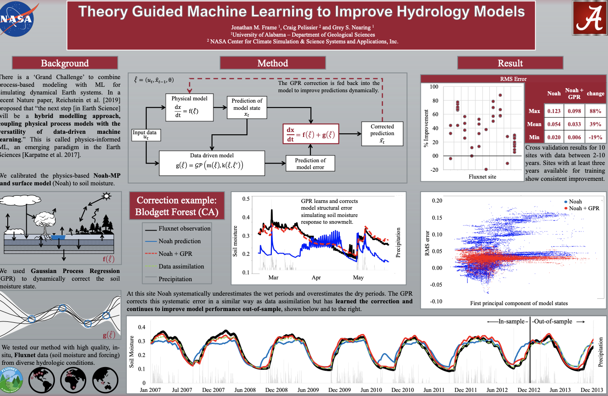

# Combining Parametric Land Surface Models with Machine Learning
We used Gaussian Process Regression (GPR) to **dynamically** correct the soil moisture state during simulations of NOAH-MP.

# Poster:

# Data
This repository has data for the PALS sites, which includes flux observations and forcing data for sites: 1,2,3,4,5,7,11,12,13,14,15,16,17,18. There are parameter values for running NOAH-MP. There is forcing and observation data for Ameriflux NR1.

# Cite as: 
* Pellisier, Frame and Nearing, 2020,  “Combining Parametric Land Surface Models with Machine Learning”. 2020 IEEE International Geoscience and Remote Sensing Symposium. [Link](https://arxiv.org/abs/2002.06141)
* Jonathan M Frame, Craig Pelissier, Grey S Nearing. Theory Guided Machine Learning to Improve Hydrology Models. ESS Open Archive . 2019. DOI: 10.22541/essoar.171322774.42947785/v1
* Frame, Pellisier, and Nearing, 2019,  “Toward Global Terrestrial Hydrology with Theory Guided Machine Learning”. American Geophysical Union, Fall meeting.
